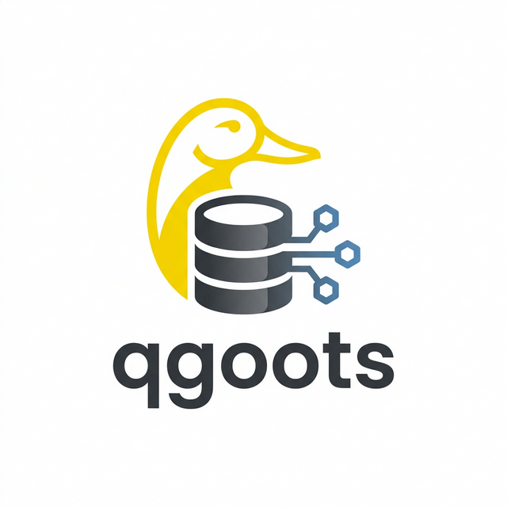

<div align="center">
  
</div>

# qgoots

qgoots is a local semantic memory engine powered by DuckDB. 
It indexes markdown documents (notes, meeting transcripts, knowledge bases) and provides hybrid search combining BM25 full-text search and vector semantic search using DuckDB as the single storage backend.

Everything runs locally — no cloud APIs required for storage and search.

## Features
- **DuckDB backend**: Fast local embedded database. Uses FTS extension for full text search and VSS for vector embeddings.
- **Markdown-aware chunking**: Splits documents intelligently.
- **Language bindings**: Available for Python, Node.js, and Golang.
- **CLI**: `qgoots` provides an easy-to-use command line interface to ingest and search.

## Architecture

```
┌─────────────────────────────────────────────────────────┐
│                      CLI (clap)                         │
│  qgoots add | index | search | vsearch | query | get   │
└──────────────────────┬──────────────────────────────────┘
                       │
┌──────────────────────▼──────────────────────────────────┐
│                   Core Engine                           │
│  ┌─────────┐  ┌──────────┐  ┌────────────┐            │
│  │ Indexer  │  │ Searcher │  │ Embedder   │            │
│  │ (ingest) │  │ (hybrid) │  │ (vectors)  │            │
│  └────┬─────┘  └────┬─────┘  └─────┬──────┘            │
│       │              │              │                   │
│  ┌────▼──────────────▼──────────────▼──────┐            │
│  │              DuckDB                      │            │
│  │  ┌─────────┐  ┌──────┐  ┌───────────┐  │            │
│  │  │ FTS ext │  │ JSON │  │ VSS ext   │  │            │
│  │  │ (BM25)  │  │      │  │ (HNSW)    │  │            │
│  │  └─────────┘  └──────┘  └───────────┘  │            │
│  └─────────────────────────────────────────┘            │
└─────────────────────────────────────────────────────────┘
```

## Supported Bindings

### Node.js (via `napi-rs`)

Inside `bindings/node`:
```bash
npm install
npm run build
```
```js
const { QgootsEngine } = require('./index');

const engine = new QgootsEngine("qgoots.duckdb");
engine.ingest("notes", "my_path.md", "# Hello\n\nThis is a note.");
const results = engine.bm25Search("note", 5);
console.log(results);
```

### Python (via `PyO3`)

Inside `bindings/python`:
```bash
pip install maturin
maturin develop
```

```python
import qgoots

engine = qgoots.QgootsEngine("qgoots.duckdb")
engine.ingest("notes", "my_path.md", "# Hello\n\nThis is a note.")
results = engine.bm25_search("note", 5)
print(results)
```

### Golang (via `cgo`)

Inside `bindings/go`:
Build the C-FFI wrapper in `bindings/c` first (`cargo build --release`), then:
```go
package main

import (
    "fmt"
    "log"
    "qgoots"
)

func main() {
    engine, err := qgoots.NewEngine("qgoots.duckdb")
    if err != nil {
        log.Fatal(err)
    }

    engine.Ingest("notes", "mypath.md", "hello world")
    res, _ := engine.SearchBM25("hello", 10)
    fmt.Println(res)
}
```

## CLI Usage

```bash
# Initialize DB
cargo run -p qgoots-cli -- init

# Add current directory as a knowledge source
cargo run -p qgoots-cli -- collection add ./my-notes

# Index all markdown files
cargo run -p qgoots-cli -- index

# Perform a search
cargo run -p qgoots-cli -- search "hello"
```

## Model Context Protocol (MCP) Integration

`qgoots` exposes a local MCP server that allows AI agents (like Claude Code, Claude Desktop, Cursor) to use your local DuckDB indices for context injection and retrieval.

To use qgoots via MCP, start the server using the CLI:

### Claude Code (`~/.claude/mcp_servers.json`)

```json
{
  "qgoots": {
    "command": "cargo",
    "args": ["run", "--release", "-p", "qgoots-cli", "--", "serve"],
    "type": "stdio"
  }
}
```

### Claude Desktop (`claude_desktop_config.json`)

```json
{
  "mcpServers": {
    "qgoots": {
      "command": "/path/to/your/compiled/qgoots-cli",
      "args": ["serve"]
    }
  }
}
```

Once connected, your agents can use tools like `qgoots_search`, `qgoots_vsearch`, `qgoots_query`, and `qgoots_ingest` directly.

## Skill

If you are an agent looking to interact with this repository, read the [`SKILL.md`](SKILL.md) file.
